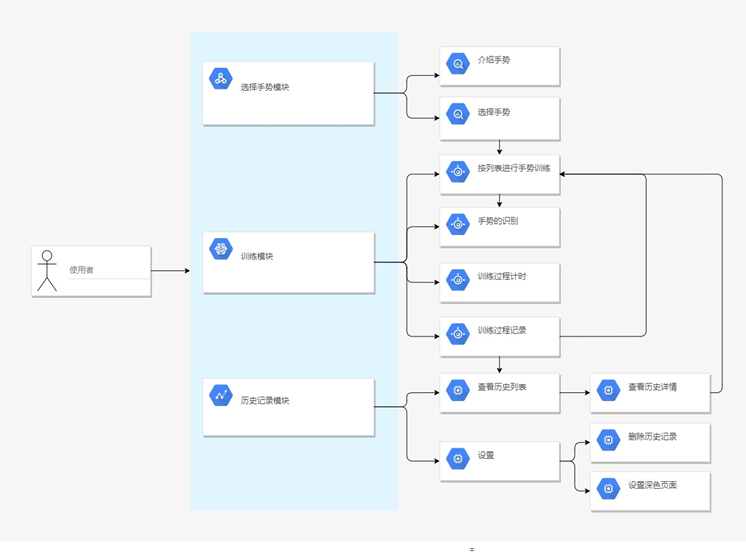

# Hand Train

Based on YOLOv5 's Flutter project.

图像识别技术现在已经在很多领域都有多应用，例如人脸识别，车牌识别，监控警报等。本课题使用卷积神经网络进行手部及手势的识别，可以在康复治疗领域协助医护、患者，以更加便捷、花费更低、限制更少的情况下进行手部康复训练。
本课题设计并实现了一个手部锻炼App，该App具有待训练手势的介绍，选择，排序，训练，计时等功能，对于训练记录具有数据库持久化存储，对于所选手势具有缓存存储。其中主要功能为手势训练模块，该模块主要包括手势的识别，识别过程的计时，训练过程的记录。其中使用目标检测技术实现了手势识别，可有助于患者借助本App进行手部康复训练。
本课题首先基于YOLOv5平台，训练CNN模型用于进行手势识别，本课题根据Brunnstrom六级评价法设计了8种康复手势，每种手势根据识别状况标注了20-30张数据，共186张构成本课题训练所使用的数据集，训练模型准确率（precision）可达95%，召回率（recall）达88%。而后将训练得到的Pytorch模型转化为tflite模型。
Android App部分，使用Dart语言，基于Flutter框架。将手机摄像头拍摄到的视频流喂入转化得到的tflite模型，实现手势识别，通过识别到手势的时间与总训练比作为结果的评判标准，并进行记录。数据存储使用SharedPreferences作为缓存，Sqlite作为持久化存储。

